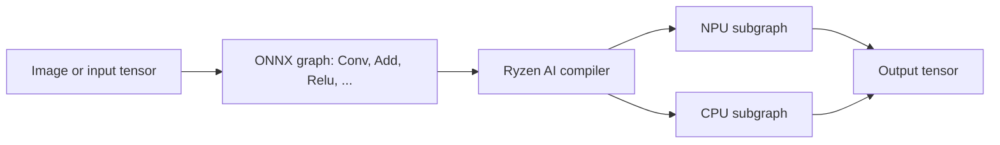

# Experiment 004: Why does a model run on the NPU?

## Three different meanings of “instruction”

1. A model file describes **tensor operations** such as `Conv` (convolution), `Add`, `Relu`, `Reshape`, and `QuantizeLinear`. These are ONNX operators, not NPU machine instructions.
2. Ryzen AI's **compiler** checks the model's operations, data types, shapes, and configuration. It turns supported connected regions of the graph into NPU programs; remaining regions can run on the CPU. [AMD describes this automatic partitioning](https://ryzenai.docs.amd.com/en/1.7/modelrun.html).
3. Inside the chip, the compiled program uses the XDNA **AI Engine tiles**, which have vector and scalar processors, local memory, and tile-to-tile data paths. This is the hardware instruction level. [AMD's XDNA architecture overview](https://www.amd.com/en/technologies/xdna.html) describes those components. The ONNX operator list is a practical compatibility guide; it is not a list of raw tile instructions.



## What this particular laptop supports

The Ryzen 9 8945HS is in AMD's Phoenix/Hawk Point family. In the [Ryzen AI 1.7 compatibility table](https://ryzenai.docs.amd.com/en/1.7/relnotes.html), that family is supported for **INT8 CNNs**. The table does not list BF16 CNNs, BF16 NLP, or the official ONNX Runtime GenAI LLM flow for this family. This describes AMD's supported software path in version 1.7; it is not a claim that the hardware could never execute any other calculation through custom programming.

INT8 means much of the model's arithmetic and stored values are represented with 8-bit integers. A quantized ONNX model often has `QuantizeLinear` and `DequantizeLinear` nodes around convolutions. [AMD's quantization guide](https://ryzenai.docs.amd.com/en/1.7/model_quantization.html) explains the supported XINT8, A8W8, and A16W8 schemes. A model being labeled “INT8” is insufficient by itself: its operator patterns, tensor shapes, quantization details, and compiler settings still need to fit the target. AMD's [operator table](https://ryzenai.docs.amd.com/en/1.7/ops_support.html) explicitly says listed coverage is broad and some configurations may still be unsupported.

On this family, AMD specifies `target=X1` and the Phoenix `4x4.xclbin` file. AMD's [installation example](https://ryzenai.docs.amd.com/en/1.7/inst.html) also sets `xlnx_enable_py3_round=0` for Phoenix/Hawk Point.

## A controlled experiment on our ResNet50

The raw `resnet50_pt.onnx` file contains 1,217 ONNX nodes, including 727 `Constant`, 181 `QuantizeLinear`, 181 `DequantizeLinear`, 53 `Conv`, and 49 `Relu` nodes. The compiler simplifies and groups the graph, so its assignment report has 395 nodes. These two node counts describe different stages and should not be compared as an offload percentage.

[`004_operator_assignment.py`](004_operator_assignment.py) creates two sessions with the **same model, input, target, firmware, and Ryzen AI version**. Only the execution setting `xlnx_enable_py3_round` changes; separate cache keys keep the compiled versions apart. It requests AMD's [operator assignment report](https://ryzenai.docs.amd.com/en/1.7/modelrun.html#operator-assignment-report), then actually runs one inference in each session.

| Setting | NPU nodes | CPU-side nodes | Output |
| --- | ---: | ---: | --- |
| Omit `xlnx_enable_py3_round` | 0 | 395 | Finite, shape `1×1000` |
| Set `xlnx_enable_py3_round=0` | 393 | 2 | Finite, shape `1×1000` |

In the first run, the report divides those 395 nodes into 123 `CPU` and 272 `VITIS_EP_CPU`. In the second, it assigns 393 nodes to `NPU` and leaves one `QuantizeLinear` and one `DequantizeLinear` on `VITIS_EP_CPU`. **Both sessions report `VitisAIExecutionProvider` as available.** The provider name therefore does not prove that any work reached the NPU. This is an observation on this model, machine, and software build; the experiment does not establish the internal reason that this setting changes compilation.

RetinaFace provides another mixed-execution example: its report assigned 356 optimized nodes to NPU and four quantize/dequantize nodes to `VITIS_EP_CPU`. It worked, but in [experiment 003](003_model_compatibility.md) its NPU inference was slightly slower than CPU inference. Offloading and speedup are different questions. Startup/compilation, transfers, CPU-side work, model size, and NPU efficiency can all affect total time; we have not isolated which one dominates RetinaFace here.

## Reproduce and inspect

First extract AMD's models as described in [experiment 003](003_model_compatibility.md). From the repo root:

```powershell
& "$env:USERPROFILE\miniforge3\envs\ryzen-ai-1.7.0\python.exe" experiments\004_operator_assignment.py
```

The script prints the raw ONNX operator mix and both assignment summaries. Full AMD-generated reports stay in ignored `cache/operator_assignment/`, one folder per configuration. If Ryzen AI or the NPU driver is updated, pass a new `--cache-dir` before repeating the experiment; [AMD warns against reusing compiled caches across versions](https://ryzenai.docs.amd.com/en/1.7/modelrun.html#vitisai-ep-cache).

To investigate a new model, ask these questions in order:

1. **What graph is it?** Inspect ONNX input shapes, operator types, and quantization nodes.
2. **What software path applies?** Check the device family, Ryzen AI version, data type, target, and firmware.
3. **Where did the compiler place work?** Read the operator assignment report or the `Actually running on NPU` log line. A successful inference and a provider name are not enough.
4. **Are the answers useful?** Compare NPU and CPU outputs on identical inputs, then measure inference time after warm-up. Use labeled examples to check actual task accuracy.

This sequence separates four distinct questions: **can the model load, can any graph region compile for the NPU, is it faster, and is it accurate?**
